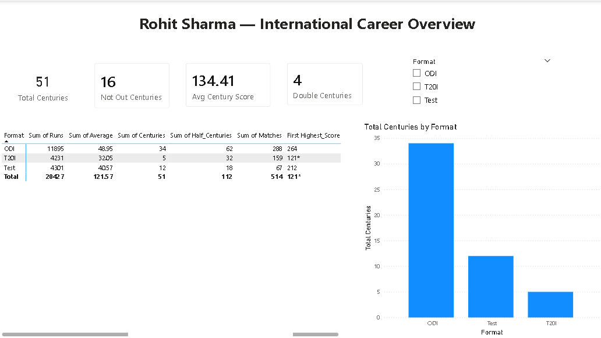
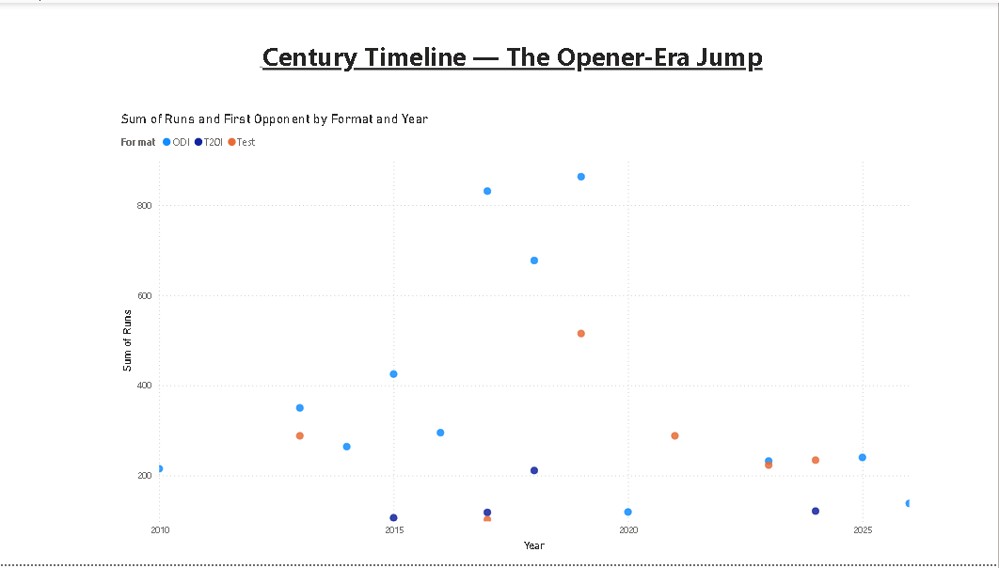
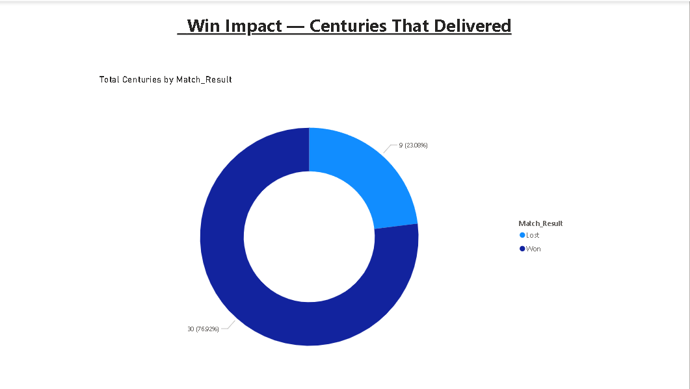

 # 🏏 Rohit Sharma — Career Stats Power BI Dashboard

A Power BI Dashboard Analyzing All 51 International centuries And The Complete
International Career Record Of Rohit Sharma Across Test, ODI and T20I Formats.

## 📊 Dashboard Pages
1. **Career Overview** — KPI Cards And Format-Wise Career Stats
2. **Century Timeline** — All 51 Centuries Plotted by Year, Showing The 2019 "Opener Era" Jump
3. **Win Impact** — Centuries Broken Down By Match Result (Won vs Lost)

## 📁 Files
- `rohit_sharma_centuries.csv` — All 51 Centuries (Score, Opponent, Venue, Date, Result)
- `rohit_sharma_career_summary.csv` — Career Totals By Format
- `Rohit-Sharma-PowerBI-Dashboard.pbix` — The Power BI File

## 🔑 Key Insights
- 51 International centuries Across 3 Formats, Including 3 of Cricket's Only ODI Double-Centuries (209, 264, 208*)
- His 264 vs Sri Lanka (2014) Remains The Highest Individual score In ODI history
- Clear Career Reinvention: Shift to Opener from 2019 Significantly Boosted His Output
- His Final International Century — 138 at Lord's, 19 July 2026 — made Him The First Indian To Score An ODI century there
- The Large Majority Of His Centuries Came In Wins, Showing Consistent Match-Winning Impact

## 🛠️ Tools Used
Power BI Desktop, Power Query, DAX
